# Location Sync Gateway

<div align="center">

[](https://kotlinlang.org/)
[](https://micronaut.io/)
[](https://www.postgresql.org/)
[](https://kafka.apache.org/)

**Data conflict resolution engine for multi-location brands**

[Quick Start](#quick-start) • [Architecture](#architecture) • [API](#api) • [Use Cases](#use-cases)

</div>

---

## Overview

Detects and resolves location data conflicts between external sources (Google My Business, POS systems, ERP) and Uberall's platform. When franchisees edit Google Business Profile directly, POS systems signal closures, or ERP data conflicts with live listings — this gateway catches it before customers are affected.

**Core Capabilities**
- Multi-source data ingestion via pluggable connectors (Google, POS, ERP, Franchise APIs)
- Field-level conflict detection comparing external sources against Uberall as system of record
- Configurable priority-based resolution engine (YAML rules, version-controlled)
- Automated execution with Uberall API integration for corrections
- Event-driven architecture with Kafka for async processing
- Human-in-the-loop workflow with Slack/Email notifications for ambiguous cases
- Full audit trail for every decision (compliance-ready)
- OAuth 2.0 integration for secure external API access

## The Problem

**Scene 1: The Data War**
Franchisee edits Google Business Profile directly → Uberall doesn't know → Next sync overwrites the edit → Franchisee edits again → Endless conflict. Neither wins. Customer sees inconsistent data.

**Scene 2: The Silent Closure**
Branch closes for renovation → POS shows zero transactions for 5 days → Nobody updates Uberall → Google Maps shows "open" → Customers drive there, find it closed → Angry 1-star reviews.

**Scene 3: The Authority Conflict**
Head office sets standard hours 9-6 → Local franchisee knows their market needs 8-8 → Edits Google directly → Uberall reverts → Franchisee re-edits → Data war continues.

**Root Cause:** Uberall doesn't know what it doesn't know. UB-I optimizes based on what's inside the platform — this gateway feeds it better data from outside the platform boundary.

## Architecture

```mermaid
flowchart LR
    subgraph SOURCES["🌐 EXTERNAL SOURCES"]
        direction TB
        GMB["Google My Business<br/>(OAuth 2.0)"]
        POS["POS System"]
        ERP["ERP System"]
        FRAN["Franchise API"]
    end

    subgraph CONNECTORS["🔌 CONNECTOR LAYER"]
        direction TB
        GMB_CONN["GoogleConnector"]
        POS_CONN["PosConnector"]
        ERP_CONN["ErpConnector"]
        FRAN_CONN["FranchiseConnector"]
        WH_CONN["WebhookConnector"]
        CUSTOM["CustomConnector"]
    end

    subgraph INGESTION["⚙️ INGESTION"]
        direction TB
        INGEST["Scheduler<br/>(@Scheduled)<br/>Pull • Validate<br/>Deduplicate"]
        KAFKA["Kafka<br/>location.snapshots"]
    end

    subgraph PROCESSING["🔍 PROCESSING"]
        direction TB
        DETECT["Conflict<br/>Detector"]
        RESOLVE["Resolution<br/>Engine<br/>(YAML Rules)"]
    end

    subgraph OUTCOMES["📊 OUTCOMES"]
        direction TB
        ACCEPT["✅ AUTO_ACCEPT"]
        REVERT["🔄 AUTO_REVERT"]
        REVIEW["⚠️ FLAG_REVIEW"]
    end

    subgraph EXECUTION["🎯 EXECUTION"]
        direction TB
        UBERALL["Uberall API<br/>PATCH locations"]
        DB["PostgreSQL<br/>Audit Log"]
        NOTIFY["Notifications<br/>Slack • Email"]
    end

    subgraph INFRA["💾 INFRASTRUCTURE"]
        direction TB
        REDIS["Redis Cache<br/>Tokens • Data"]
        API["REST API<br/>/sync • /conflicts<br/>/decisions"]
    end

    SOURCES --> CONNECTORS
    CONNECTORS --> INGEST
    INGEST --> KAFKA
    KAFKA --> DETECT
    DETECT --> RESOLVE
    RESOLVE --> ACCEPT
    RESOLVE --> REVERT
    RESOLVE --> REVIEW
    ACCEPT --> UBERALL
    ACCEPT --> DB
    REVERT --> UBERALL
    REVERT --> DB
    REVIEW --> NOTIFY
    REVIEW --> DB
    UBERALL --> REDIS
    DB --> REDIS
    REDIS --> API

    style SOURCES fill:#ffffff,stroke:#1976D2,stroke-width:3px,color:#000
    style CONNECTORS fill:#ffffff,stroke:#388E3C,stroke-width:3px,color:#000
    style INGESTION fill:#ffffff,stroke:#F57C00,stroke-width:3px,color:#000
    style PROCESSING fill:#ffffff,stroke:#7B1FA2,stroke-width:3px,color:#000
    style OUTCOMES fill:#ffffff,stroke:#C2185B,stroke-width:3px,color:#000
    style EXECUTION fill:#ffffff,stroke:#00796B,stroke-width:3px,color:#000
    style INFRA fill:#ffffff,stroke:#455A64,stroke-width:3px,color:#000

    style GMB fill:#ffffff,stroke:#1976D2,stroke-width:2px,color:#000
    style POS fill:#ffffff,stroke:#1976D2,stroke-width:2px,color:#000
    style ERP fill:#ffffff,stroke:#1976D2,stroke-width:2px,color:#000
    style FRAN fill:#ffffff,stroke:#1976D2,stroke-width:2px,color:#000

    style GMB_CONN fill:#ffffff,stroke:#388E3C,stroke-width:2px,color:#000
    style POS_CONN fill:#ffffff,stroke:#388E3C,stroke-width:2px,color:#000
    style ERP_CONN fill:#ffffff,stroke:#388E3C,stroke-width:2px,color:#000
    style FRAN_CONN fill:#ffffff,stroke:#388E3C,stroke-width:2px,color:#000
    style WH_CONN fill:#ffffff,stroke:#388E3C,stroke-width:2px,color:#000
    style CUSTOM fill:#ffffff,stroke:#388E3C,stroke-width:2px,color:#000

    style INGEST fill:#ffffff,stroke:#F57C00,stroke-width:2px,color:#000
    style KAFKA fill:#ffffff,stroke:#000,stroke-width:2px,color:#000

    style DETECT fill:#ffffff,stroke:#7B1FA2,stroke-width:2px,color:#000
    style RESOLVE fill:#ffffff,stroke:#7B1FA2,stroke-width:2px,color:#000

    style ACCEPT fill:#ffffff,stroke:#4CAF50,stroke-width:3px,color:#000
    style REVERT fill:#ffffff,stroke:#FF9800,stroke-width:3px,color:#000
    style REVIEW fill:#ffffff,stroke:#F44336,stroke-width:3px,color:#000

    style UBERALL fill:#ffffff,stroke:#00796B,stroke-width:2px,color:#000
    style DB fill:#ffffff,stroke:#00796B,stroke-width:2px,color:#000
    style NOTIFY fill:#ffffff,stroke:#00796B,stroke-width:2px,color:#000

    style REDIS fill:#ffffff,stroke:#C62828,stroke-width:2px,color:#000
    style API fill:#ffffff,stroke:#455A64,stroke-width:2px,color:#000
```



<p align="center">
  <em>Event-driven architecture with pluggable connectors - Horizontally scalable via Kafka consumers</em>
</p>

**Architecture Pattern:** Connector-Based Event-Driven Pipeline with Strategy-Based Conflict Resolution

**Stack**: Kotlin • Micronaut • PostgreSQL • Kafka • Redis • Google OAuth 2.0 • Flyway • Prometheus

## How It Works

### 1. Data Ingestion
- **@Scheduled** job runs every 5 minutes
- Each connector pulls location data from its source
- Snapshots published to Kafka topic `location.snapshots`
- Async processing decouples ingestion from resolution

### 2. Conflict Detection
- Kafka consumer receives snapshot
- Fetches current Uberall data for comparison
- Field-by-field diff identifies conflicts
- Conflict stored in PostgreSQL with full context

### 3. Resolution Engine
- Loads YAML rules from version-controlled config
- Matches rule by field type + source + location pattern
- Applies confidence threshold checks
- Produces one of three outcomes:

**AUTO_ACCEPT** → External value is more accurate
**AUTO_REVERT** → Uberall value is authoritative
**FLAG_FOR_REVIEW** → Ambiguous, needs human decision

### 4. Execution
- AUTO_ACCEPT → PATCH Uberall API with new value
- AUTO_REVERT → Trigger Uberall sync to revert external edit
- FLAG_FOR_REVIEW → Send Slack notification to ops team
- All actions logged to audit table with full context

### 5. Audit & Compliance
- Every conflict detected → PostgreSQL row
- Every resolution decision → Audit log entry
- Every Uberall API call → Request/response logged
- Idempotency keys prevent duplicate updates

## Quick Start

### Current Implementation Status

**✅ Currently Implemented:**
- Core conflict detection and resolution logic
- Mock Google My Business connector with test data
- In-memory storage (no database setup required)
- REST API for manual sync triggering
- Resolution engine with hardcoded rules (phone, opening hours, categories)
- Unit tests for all core components

**⏳ Planned Features:**
- PostgreSQL persistence layer
- Kafka event streaming for async processing
- Real external API integrations (Google OAuth, POS, ERP)
- Scheduled automated execution
- Notification system (Slack, Email)
- YAML-based configuration for resolution rules
- Management dashboard UI
- Production monitoring and observability

### Prerequisites
- JDK 17+
- Gradle 8+ (or use wrapper - `./gradlew`)

### Run Locally

```bash
# Clone repository
git clone https://github.com/c-kiplimo/Location-Sync-Gateway.git
cd Location-Sync-Gateway

# Run application (no Docker needed for current version)
./gradlew run

# Or on Windows
gradlew.bat run
```

**Server starts at `http://localhost:8080`**

### Test the API

```bash
# Trigger sync for test locations (1001-1004 have mock data)
curl -X POST "http://localhost:8080/api/v1/sync/trigger?locationIds=1001,1002,1003,1004"

# Expected output:
# {
#   "locationsProcessed": 4,
#   "conflictsDetected": 3,
#   "autoAccepted": 1,
#   "autoReverted": 1,
#   "flaggedForReview": 1
# }

# View all detected conflicts
curl http://localhost:8080/api/v1/conflicts

# View resolution decisions
curl http://localhost:8080/api/v1/decisions

# View conflicts flagged for human review
curl http://localhost:8080/api/v1/conflicts/flagged

# Health check
curl http://localhost:8080/api/v1/health
```

### Test Scenarios

| Location ID | Conflict | Expected Resolution |
|-------------|----------|---------------------|
| **1001** | Phone differs from Uberall | AUTO_REVERT (HQ controls phone) |
| **1002** | Opening hours differ from Uberall | AUTO_ACCEPT (franchisees control hours) |
| **1003** | Category differs from Uberall | FLAG_FOR_REVIEW (no rule configured) |
| **1004** | All fields match | No conflicts detected |

## API

### Endpoints

| Method | Endpoint | Description |
|--------|----------|-------------|
| POST | `/api/v1/sync/trigger` | Trigger manual sync for location IDs |
| GET | `/api/v1/conflicts` | Get all detected conflicts |
| GET | `/api/v1/conflicts/location/{id}` | Get conflicts for specific location |
| GET | `/api/v1/conflicts/flagged` | Get conflicts needing human review |
| GET | `/api/v1/decisions` | Get all resolution decisions |
| GET | `/api/v1/decisions/conflict/{id}` | Get decision for specific conflict |
| GET | `/api/v1/audit/location/{id}` | Get audit log for location |
| GET | `/api/v1/rules` | List all resolution rules |
| POST | `/api/v1/rules` | Create new resolution rule |
| PUT | `/api/v1/rules/{id}` | Update resolution rule |
| DELETE | `/api/v1/rules/{id}` | Delete resolution rule |
| GET | `/api/v1/connectors/health` | Check health of all connectors |
| GET | `/api/v1/health` | Application health check |

### Response Format

All responses use standardized wrapper:

```json
{
  "meta": {
    "requestId": "550e8400-e29b-41d4-a716-446655440000",
    "status": "success",
    "statusDesc": "Operation completed",
    "respondedAt": "2026-06-15T10:30:00Z"
  },
  "payload": {
    "locationsProcessed": 4,
    "conflictsDetected": 3,
    "autoAccepted": 1,
    "autoReverted": 1,
    "flaggedForReview": 1
  }
}
```

### Sample Responses

**Conflict Response:**
```json
{
  "id": "550e8400-e29b-41d4-a716-446655440000",
  "locationId": 1001,
  "fieldType": "PHONE",
  "source": "GOOGLE_MY_BUSINESS",
  "externalValue": "+254799999999",
  "uberallValue": "+254712345678",
  "confidence": 1.0,
  "detectedAt": "2026-06-15T10:30:00Z"
}
```

**Resolution Decision Response:**
```json
{
  "id": "660e8400-e29b-41d4-a716-446655440001",
  "conflictId": "550e8400-e29b-41d4-a716-446655440000",
  "locationId": 1001,
  "fieldType": "PHONE",
  "source": "GOOGLE_MY_BUSINESS",
  "externalValue": "+254799999999",
  "uberallValue": "+254712345678",
  "outcome": "AUTO_REVERT",
  "reason": "Phone numbers are centrally managed by head office",
  "ruleApplied": "google-phone-hq-override",
  "actionTaken": "UBERALL_SYNC_TRIGGERED",
  "decidedAt": "2026-06-15T10:30:01Z",
  "executedAt": "2026-06-15T10:30:02Z"
}
```

## Resolution Rules Configuration

Rules defined in YAML, checked into version control:

```yaml
# resolution-rules.yml
rules:
  - name: google-opening-hours-franchisee
    fieldType: OPENING_HOURS
    source: GOOGLE_MY_BUSINESS
    locationPattern: "franchise.*"       # Regex pattern
    defaultOutcome: AUTO_ACCEPT          # Franchisees control hours
    minimumConfidence: 0.9
    conditions:
      - type: VALUE_WITHIN_RANGE
        field: openingHourSpan
        min: 6                           # Min 6 hours per day
        max: 16                          # Max 16 hours per day

  - name: google-phone-hq-override
    fieldType: PHONE
    source: GOOGLE_MY_BUSINESS
    defaultOutcome: AUTO_REVERT          # HQ controls phone numbers
    minimumConfidence: 1.0
    reason: "Phone numbers are centrally managed"

  - name: google-category-brand-standard
    fieldType: CATEGORIES
    source: GOOGLE_MY_BUSINESS
    defaultOutcome: AUTO_REVERT          # Brand category non-negotiable
    minimumConfidence: 1.0

  - name: pos-temporary-closure
    fieldType: TEMPORARY_CLOSURE
    source: POS_SYSTEM
    defaultOutcome: FLAG_FOR_REVIEW      # Always confirm before closing
    minimumConfidence: 0.85
    notifyChannel: slack
    notifyTarget: "#location-ops-alerts"

  - name: erp-planned-closure
    fieldType: TEMPORARY_CLOSURE
    source: ERP_SYSTEM
    defaultOutcome: AUTO_ACCEPT          # ERP work orders are authoritative
    minimumConfidence: 1.0
```

### Resolution Outcomes

| Outcome | Behavior | Use Case |
|---------|----------|----------|
| **AUTO_ACCEPT** | Update Uberall with external value | Franchisee sets local hours |
| **AUTO_REVERT** | Trigger Uberall sync to revert external edit | Unauthorized category change |
| **FLAG_FOR_REVIEW** | Send Slack notification, wait for human | POS signals possible closure |

## Use Cases

### 1. Franchisee Edits Opening Hours
**Scenario:** Franchisee in Mombasa extends hours to 8am-8pm on Google Business Profile because of local market demand.

**Detection:** Google connector pulls snapshot, detects hours differ from Uberall's 9am-6pm.

**Resolution:** Rule `google-opening-hours-franchisee` applies → AUTO_ACCEPT (franchisees allowed to set hours within 6-16 hour range).

**Action:** PATCH Uberall API to update opening hours to 8am-8pm.

**Result:** Both systems aligned. No data war. Customers see correct hours.

---

### 2. POS System Signals Closure
**Scenario:** POS system shows zero transactions for 3 consecutive trading days. Branch might be closed for renovation.

**Detection:** POS connector infers closure signal with confidence 0.80.

**Resolution:** Rule `pos-temporary-closure` applies → FLAG_FOR_REVIEW (confidence below 0.85 threshold).

**Action:** Slack message to `#location-ops-alerts` with full context.

**Result:** Ops team confirms closure, manually updates Uberall before customers affected.

---

### 3. Unauthorized Category Change
**Scenario:** Someone changes Google Business Profile category from "Restaurant" to "Bar".

**Detection:** Google connector pulls category, detects conflict.

**Resolution:** Rule `google-category-brand-standard` applies → AUTO_REVERT (brand categories are centrally controlled).

**Action:** Trigger Uberall sync to push correct category back to Google.

**Result:** Brand consistency maintained across all locations.

---

### 4. ERP Signals Planned Renovation
**Scenario:** ERP system has active work order for branch renovation, start date tomorrow.

**Detection:** ERP connector pulls work order, creates TEMPORARY_CLOSURE snapshot with confidence 1.0.

**Resolution:** Rule `erp-planned-closure` applies → AUTO_ACCEPT (ERP is authoritative for planned closures).

**Action:** Update Uberall with temporary closure dates.

**Result:** Google Maps shows "Temporarily Closed" before customers try to visit.

## Configuration

```yaml
# src/main/resources/application.yml
micronaut:
  application:
    name: location-sync-gateway
  server:
    port: 8080

datasources:
  default:
    url: jdbc:postgresql://localhost:5432/location_sync_gateway
    username: lsg
    password: ${DB_PASSWORD}
    driverClassName: org.postgresql.Driver

flyway:
  datasources:
    default:
      enabled: true

kafka:
  bootstrap:
    servers: localhost:9092
  producers:
    default:
      key-serializer: org.apache.kafka.common.serialization.StringSerializer
      value-serializer: io.micronaut.kafka.serdes.JsonSerializer
  consumers:
    default:
      key-deserializer: org.apache.kafka.common.serialization.StringDeserializer
      value-deserializer: io.micronaut.kafka.serdes.JsonDeserializer

redis:
  uri: redis://localhost:6379
  caches:
    location-data:
      expire-after-write: 5m
    oauth-tokens:
      expire-after-write: 55m

google:
  oauth:
    clientId: ${GOOGLE_OAUTH_CLIENT_ID}
    clientSecret: ${GOOGLE_OAUTH_CLIENT_SECRET}

uberall:
  api:
    baseUrl: https://uberall.com/api
    privateKey: ${UBERALL_PRIVATE_KEY}

scheduler:
  ingestion:
    enabled: true
    fixedDelay: 5m
    initialDelay: 30s

notifications:
  slack:
    webhookUrl: ${SLACK_WEBHOOK_URL}
    channel: "#location-ops-alerts"
```

## Development

### Build
```bash
./gradlew clean build
```

### Run Tests
```bash
./gradlew test
```

### Database Migrations
Auto-applied via Flyway on startup. Files in `src/main/resources/db/migration/`

---

## Implementation Roadmap

### Phase 1: Core Proof of Concept ✅ (COMPLETE)

**Goal:** Demonstrate end-to-end conflict detection and resolution flow with minimal infrastructure.

**Implementation Steps:**
1. Define core domain models (LocationSnapshot, Conflict, ResolutionDecision, ResolutionOutcome enum)
2. Create LocationConnector interface for pluggable external data sources
3. Implement MockGoogleMyBusinessConnector with hardcoded test data for 4 location scenarios
4. Implement MockUberallDataService with hardcoded baseline data for comparison
5. Build ConflictDetector service to compare snapshot fields against Uberall data
6. Build ResolutionEngine service with hardcoded if/else rules for field+source combinations
7. Create InMemoryStorage service using ConcurrentHashMap for conflicts and decisions
8. Implement SyncService to orchestrate full pipeline: pull → detect → resolve → store
9. Build REST API controller with endpoints for manual triggering and viewing results
10. Write unit tests for ConflictDetector, ResolutionEngine, and InMemoryStorage
11. Test end-to-end flow with 4 test locations via REST API

**Success Criteria:**
- Manual sync trigger detects conflicts correctly
- Resolution rules apply as expected (AUTO_ACCEPT, AUTO_REVERT, FLAG_FOR_REVIEW)
- All conflicts and decisions retrievable via REST API
- Unit tests pass with 100% coverage of core logic

---

### Phase 2: Persistence & Automation ⏳ (PLANNED)

**Goal:** Make system production-ready with real persistence and automated execution.

**Implementation Steps:**

#### Database Layer
1. Add PostgreSQL and Flyway dependencies to build.gradle.kts
2. Create Flyway migration: V1__create_tables.sql for conflicts, decisions, rules, mappings tables
3. Create Flyway migration: V2__create_indexes.sql for performance optimization
4. Create Flyway migration: V3__seed_rules.sql to pre-populate resolution rules
5. Implement JPA/JDBC repository interfaces for each table (ConflictRepository, DecisionRepository, etc.)
6. Replace InMemoryStorage with PostgreSQL repositories in all services
7. Add database connection pooling configuration (HikariCP)
8. Write integration tests using Testcontainers for PostgreSQL

#### YAML Configuration
9. Create resolution-rules.yml file with all resolution rules in structured format
10. Implement RulesRepository to load YAML rules on startup and cache in memory
11. Update ResolutionEngine to query rules from repository instead of hardcoded logic
12. Add rule validation on startup to catch configuration errors early
13. Implement rules reload endpoint for runtime updates without restart

#### Scheduled Execution
14. Annotate SyncService orchestration method with @Scheduled(fixedDelay = "5m")
15. Add configuration properties for schedule timing (fixedDelay, initialDelay)
16. Implement application.yml with scheduler enable/disable flag
17. Add scheduler state monitoring endpoint for observability

#### Uberall API Integration
18. Create UberallApiClient with HTTP client configuration for external calls
19. Implement UberallApiExecutor service to handle PATCH requests for AUTO_ACCEPT outcomes
20. Implement sync triggering for AUTO_REVERT outcomes
21. Add idempotency logic using Redis or database keys to prevent duplicate updates
22. Implement retry logic with exponential backoff for failed API calls
23. Add circuit breaker pattern for graceful degradation when Uberall API is down
24. Use WireMock in tests to stub Uberall API responses

#### Audit & Compliance
25. Implement AuditLogger service to record every conflict detection event
26. Log every resolution decision with full context (rule applied, reason, timestamp)
27. Log every Uberall API call with request payload and response status
28. Add audit query endpoints for compliance reporting

**Success Criteria:**
- System runs automatically every 5 minutes
- All data persists across restarts
- Rules loaded from YAML and applied correctly
- Uberall API called with proper payloads (verified via WireMock)
- Idempotency prevents duplicate API calls
- Full audit trail queryable via API
- Integration tests pass with real database and mocked external APIs

---

### Phase 3: Multi-Source & Event Streaming ⏳ (PLANNED)

**Goal:** Add multiple data sources and asynchronous processing with Kafka.

**Implementation Steps:**

#### Kafka Infrastructure
1. Add Kafka and Micronaut Kafka dependencies to build.gradle.kts
2. Create docker-compose.yml with Kafka, Zookeeper, PostgreSQL, Redis services
3. Configure Kafka producers in application.yml (serializers, topic names)
4. Configure Kafka consumers in application.yml (deserializers, consumer groups)
5. Create Kafka topic: location.snapshots with appropriate partitions and replication

#### Event-Driven Architecture
6. Implement SnapshotProducer service to publish LocationSnapshot events to Kafka
7. Refactor IngestionScheduler to publish to Kafka instead of direct processing
8. Implement SnapshotConsumer service to consume from location.snapshots topic
9. Move conflict detection and resolution logic into Kafka consumer
10. Add dead letter queue (DLQ) topic for failed message processing
11. Implement Kafka consumer error handling and retry logic
12. Add consumer offset management for exactly-once semantics

#### POS System Connector
13. Define PosSystemClient interface for external POS system integration
14. Implement PosSystemConnector to query transaction counts for lookback period
15. Implement zero-transaction detection logic with configurable lookback days
16. Calculate closure confidence score based on consecutive zero-transaction days
17. Create TEMPORARY_CLOSURE field snapshots when confidence exceeds threshold
18. Add POS connector health check endpoint
19. Write tests using WireMock to stub POS system API responses

#### ERP System Connector
20. Define ErpSystemClient interface for external ERP system integration
21. Implement ErpSystemConnector to query active work orders for locations
22. Filter work orders by type (renovation, maintenance) and status (active)
23. Extract closure date ranges from work order start/end dates
24. Create TEMPORARY_CLOSURE snapshots with confidence 1.0 for ERP signals
25. Add ERP connector health check endpoint
26. Write tests using WireMock to stub ERP system API responses

#### Notification Engine
27. Implement SlackClient for Slack webhook integration
28. Implement EmailClient for SMTP email sending
29. Create NotificationEngine service to handle FLAG_FOR_REVIEW outcomes
30. Build Slack message templates with conflict details and action buttons
31. Build email templates with HTML formatting and embedded context
32. Add notification channel routing based on rule configuration
33. Implement notification delivery retry logic with exponential backoff
34. Add notification delivery audit logging

**Success Criteria:**
- Kafka consumers process snapshots asynchronously and independently
- POS connector detects closure signals from transaction data
- ERP connector detects planned closures from work orders
- Slack notifications sent for FLAG_FOR_REVIEW conflicts
- System scales horizontally by adding more Kafka consumer instances
- All connectors tested with WireMock for deterministic behavior
- Dead letter queue captures failed messages for manual review

---

### Phase 4: Production & Enterprise Features ⏳ (PLANNED)

**Goal:** Real OAuth integration, advanced rules, and management UI.

**Implementation Steps:**

#### Google OAuth 2.0
1. Register application in Google Cloud Console to obtain OAuth credentials
2. Configure OAuth client ID and client secret in application.yml
3. Implement OAuthTokenStore repository to persist access and refresh tokens
4. Implement GoogleOAuthManager to handle token refresh before expiry
5. Update GoogleMyBusinessConnector to use real OAuth tokens
6. Implement OAuth callback endpoint to receive authorization codes
7. Add token expiration monitoring and proactive refresh logic
8. Implement token revocation handling when user disconnects
9. Add rate limiting compliance for Google My Business API calls
10. Write integration tests with OAuth token mocking

#### Advanced Rule Conditions
11. Extend ResolutionRule model to support complex condition types
12. Implement VALUE_WITHIN_RANGE condition for numeric field validation
13. Implement CHANGE_MAGNITUDE condition to detect suspicious large changes
14. Implement LOCATION_PATTERN condition for regex-based location filtering
15. Implement rule condition evaluator with short-circuit logic
16. Add rule testing endpoint to validate rules against sample conflicts
17. Implement rule versioning to track changes over time

#### Rules Management API
18. Implement RulesController with full CRUD endpoints for rule management
19. Add rule validation logic to prevent invalid rules from being saved
20. Implement rule activation/deactivation without deletion
21. Add rule priority ordering when multiple rules match same conflict
22. Implement rule conflict detection (overlapping rules with different outcomes)
23. Add rule usage analytics to show which rules are firing most often
24. Create audit log for all rule changes (who, when, what changed)

#### Management Dashboard (Basic)
25. Set up basic frontend project (React/Vue or Thymeleaf templates)
26. Create conflicts list view with filtering and sorting
27. Create conflict detail view with timeline and full context
28. Create decisions audit log view with date range filtering
29. Create rules management interface for CRUD operations
30. Create connector health status dashboard
31. Add location-specific conflict history view
32. Implement manual conflict resolution workflow UI

#### Metrics & Observability
33. Add Micrometer and Prometheus dependencies
34. Implement metrics collectors for conflicts detected by source and field
35. Implement metrics collectors for decisions executed by outcome
36. Implement Uberall API latency histograms
37. Implement connector pull duration histograms
38. Create custom Grafana dashboards for visualization
39. Add application health check aggregator for all dependencies
40. Implement structured logging with correlation IDs for request tracing

#### Production Readiness
41. Implement circuit breaker pattern for all external API calls
42. Add retry logic with exponential backoff for transient failures
43. Implement graceful shutdown to complete in-flight processing
44. Add request rate limiting to prevent abuse of public endpoints
45. Implement API authentication and authorization (JWT tokens)
46. Add comprehensive error handling with user-friendly messages
47. Implement backup and restore procedures for PostgreSQL
48. Create runbook documentation for common operational scenarios
49. Set up staging environment mimicking production configuration
50. Perform load testing with realistic traffic patterns

**Success Criteria:**
- Real Google My Business API connection works with OAuth flow
- OAuth tokens refresh automatically before expiration
- Advanced rule conditions evaluated correctly for complex scenarios
- Dashboard allows manual conflict resolution without API calls
- All metrics exported and visible in Grafana dashboards
- Health checks report comprehensive system status
- Circuit breakers prevent cascade failures
- System handles 1000+ locations with sub-second response times
- Production deployment successful with zero downtime

---

## Project Structure

```
src/main/kotlin/com/locationsync/gateway/
├── Application.kt                    # Main entry point
├── connector/
│   ├── LocationConnector.kt          # Connector interface
│   ├── GoogleMyBusinessConnector.kt  # Google API integration
│   ├── PosSystemConnector.kt         # POS system integration
│   ├── ErpSystemConnector.kt         # ERP system integration
│   └── oauth/
│       ├── OAuthTokenStore.kt        # Token management
│       └── GoogleOAuthManager.kt     # Token refresh logic
├── controller/
│   ├── SyncController.kt             # Sync API endpoints
│   ├── ConflictsController.kt        # Conflicts API
│   ├── RulesController.kt            # Rules management API
│   └── AuditController.kt            # Audit log API
├── model/
│   ├── Conflict.kt
│   ├── LocationSnapshot.kt
│   ├── ResolutionDecision.kt
│   ├── ResolutionRule.kt
│   └── AuditEntry.kt
├── service/
│   ├── IngestionScheduler.kt         # @Scheduled ingestion
│   ├── ConflictDetector.kt           # Conflict detection logic
│   ├── ResolutionEngine.kt           # Resolution rules engine
│   ├── UberallApiExecutor.kt         # Uberall API client
│   ├── NotificationEngine.kt         # Slack/Email alerts
│   └── IdempotencyService.kt         # Duplicate prevention
├── repository/
│   ├── ConflictRepository.kt         # PostgreSQL DAO
│   ├── DecisionRepository.kt
│   ├── RulesRepository.kt
│   └── AuditRepository.kt
├── kafka/
│   ├── SnapshotProducer.kt           # Publish to Kafka
│   └── SnapshotConsumer.kt           # Consume from Kafka
└── config/
    ├── KafkaConfig.kt
    ├── RedisConfig.kt
    └── UberallClientConfig.kt

src/main/resources/
├── application.yml                   # Main config
├── resolution-rules.yml              # Conflict resolution rules
└── db/migration/                     # Flyway migrations
    ├── V1__create_tables.sql
    ├── V2__create_indexes.sql
    └── V3__seed_rules.sql
```

## External Sources Supported

| Source | What It Detects | Resolution Strategy |
|--------|-----------------|---------------------|
| **Google My Business API** | Direct edits by franchisees or customers | Accept hours/address, revert categories/phone |
| **POS System connector** | Zero transactions = closure signal | Flag for review (confidence-based) |
| **ERP System connector** | Renovation work orders = planned closure | Auto-accept (authoritative) |
| **Franchise data API** | Franchisee-managed location data | Reconcile per HQ policy |
| **Custom webhook** | Any external system push | Process via resolution engine |

## Why This Matters

### For Uberall
- **Makes UB-I Better:** Feeds UB-I accurate data by catching external edits before they cause conflicts
- **Prevents Data Wars:** Automated resolution stops endless back-and-forth between franchisees and HQ
- **Reduces Support Tickets:** Fewer customer complaints about wrong listing information
- **Competitive Differentiator:** No other location platform solves the "external edit" problem

### For Multi-Location Brands
- **Single Source of Truth:** Uberall becomes authoritative with confidence
- **Automated Compliance:** Business rules enforced automatically (phone numbers, categories)
- **Operational Efficiency:** Reduces manual reconciliation work by ops teams
- **Customer Experience:** Accurate listing information = fewer angry customers

### Revenue Impact
- **Lost Foot Traffic:** Wrong hours on Google = 5-10% customer deflection per location
- **Negative Reviews:** "Drove 20 minutes, found you closed" reviews damage ranking
- **Brand Reputation:** Inconsistent data across platforms erodes trust

## Technical Highlights

- **Kotlin Coroutines** - Async connector pulls without thread overhead
- **Event-Driven Architecture** - Kafka decouples ingestion from processing
- **Pluggable Connectors** - Add new sources by implementing one interface
- **Strategy Pattern** - Resolution rules as configurable strategies
- **Idempotent Operations** - Safe to reprocess same data (Kafka consumer offsets + Redis keys)
- **Circuit Breakers** - Graceful degradation when external APIs fail
- **OAuth Token Management** - Automatic token refresh for Google API
- **Audit-First Design** - Every decision logged immutably for compliance
- **Horizontal Scaling** - Multiple Kafka consumers process in parallel
- **Testable Architecture** - All external APIs stubbed with WireMock in tests

## Observability

### Metrics (Prometheus)
- `conflicts_detected_total{source, field_type}` - Counter
- `decisions_executed_total{outcome}` - Counter
- `uberall_api_latency_seconds` - Histogram
- `connector_pull_duration_seconds{connector_type}` - Histogram

### Health Checks
```bash
curl http://localhost:8080/api/v1/health
```

```json
{
  "status": "UP",
  "checks": [
    {"name": "postgres", "status": "UP"},
    {"name": "kafka", "status": "UP"},
    {"name": "redis", "status": "UP"},
    {"name": "uberall-api", "status": "UP", "latency": "45ms"},
    {"name": "google-connector", "status": "UP"},
    {"name": "pos-connector", "status": "UP"}
  ]
}
```

## Contributing

1. Fork the repository
2. Create feature branch (`git checkout -b feature/amazing-feature`)
3. Commit changes (`git commit -m 'Add feature'`)
4. Push to branch (`git push origin feature/amazing-feature`)
5. Open Pull Request

**Guidelines**: Follow Kotlin conventions, use coroutines for async, write tests for all business logic, maintain idempotency.

## License

MIT License - see [LICENSE](LICENSE)

---

<div align="center">

**Built for Uberall Engineering**

*Solving the data gap outside the platform boundary*

[Report Bug](https://github.com/c-kiplimo/Location-Sync-Gateway/issues) • [Request Feature](https://github.com/c-kiplimo/Location-Sync-Gateway/issues)

</div>